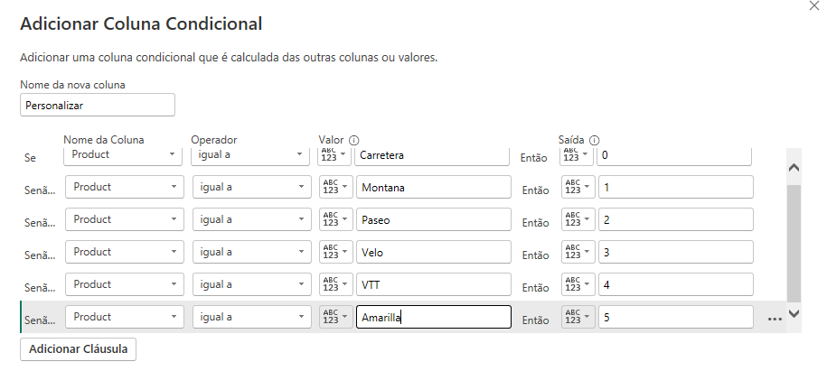
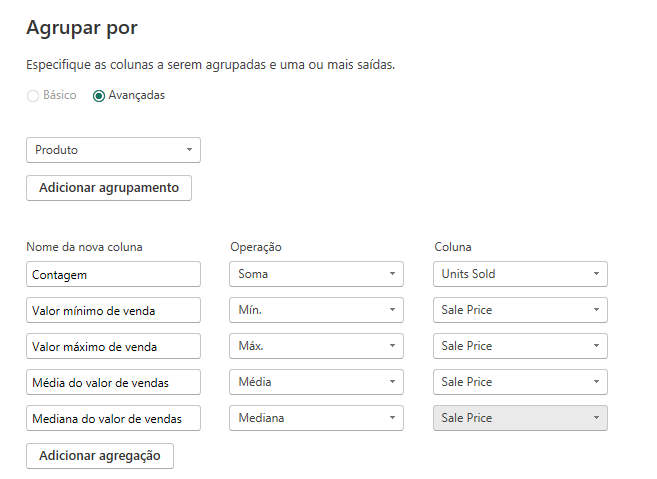

# 🌟 Construindo um Star Schema Brilhante: Explorando o Dataset Financeiro da Microsoft 🌟

**Bem-vindos, exploradores de dados!** Preparem-se para uma aventura na qual transformaremos dados brutos da amostra *Microsoft Financial Sample* em um radiante Star Schema, pronto para desvendar insights estratégicos. Vamos juntos construir um modelo que seja ao mesmo tempo eficiente e fascinante!

Este projeto faz parte do desafio do curso **"Modelando um Dashboard de E-commerce com Power BI Utilizando Fórmulas DAX"**,  ministrado por [Juliana Mascarenhas](https://www.linkedin.com/in/juliana-mascarenhas-ds/) no **Bootcamp da [NTT DATA](https://www.linkedin.com/company/ntt-data-europe-latam/posts/?feedView=all) - Engenharia de Dados com Python**, oferecido pela [DIO](https://www.dio.me/).
 

## 🚀 Desafio: Estrutura do Star Schema

Nosso objetivo é remodelar o dataset *Microsoft Financial Sample* original em um Star Schema robusto, facilitando análises ágeis e precisas. O processo é dividido em etapas, cada uma trazendo um novo brilho para o nosso esquema.

### 🔹 1. Estrutura do Star Schema

**1.1 Tabela Fato: `F_Vendas`**  
   A estrela central, `F_Vendas`, armazena dados essenciais sobre as vendas, incluindo:
   - Unidades vendidas;
   - Preço de venda, desconto, lucro;
   - Segmento e data.

**1.2 Tabelas Dimensão:**

- **D_Produtos**: Dados sobre produtos, como ID, nome e métricas de vendas (médias, medianas, máximos e mínimos).
  
- **D_Produtos_Detalhes**: Informações detalhadas dos produtos, como faixas de desconto e preço de fabricação.

- **D_Descontos**: Agrupa informações específicas sobre as faixas de desconto aplicadas.

- **D_Detalhes**: Contém detalhes financeiros e temporais, como lucro, unidades vendidas e mês.

- **D_Categoria**: Define informações sobre o país, segmento e categoria de produto.

- **D_Calendario**: Criada com a função DAX `CALENDAR()`, facilita análises temporais com uma estrutura organizada de datas.

### 🔹 2. Transformação com Power Query

**Desvendando o Poder do Power Query:**

- **D_Calendario**: Usando `CALENDAR()`, geramos uma tabela organizada por datas para análises precisas de períodos.
  
- **Renomeando Colunas**: Nomes intuitivos trazem clareza e organização ao nosso modelo.
  
- **Exclusão de Colunas**: Mantemos apenas as colunas relevantes para um esquema limpo e eficiente.
  
- **Índices Otimizados**: Criação de índices nas colunas-chave para consultas rápidas.

- **Colunas Condicionais**: Adicionamos uma coluna condicional para segmentar produtos com base em regras definidas, revelando novos insights.

   

### 🔹 3. Agrupamento e Agregação

   

**Organizando e Enriquecendo Dados:**

- **Agrupamento de Produtos**: Calculamos estatísticas como média, mediana, máximo e mínimo de vendas para cada produto, enriquecendo a análise.
  
- **Agregação Avançada**: Utilizamos somas, médias e medianas no Power Query para fornecer uma visão consolidada dos dados.

### 🌌 O Star Schema Completo

Nosso modelo final é um **Star Schema poderoso** com `F_Vendas` no centro e tabelas dimensão que orbitam como constelações de dados. Este esquema fornece insights precisos sobre vendas, padrões de descontos e desempenho de produtos, tudo em um só lugar.

 

## 📈 Visualização do Star Schema ⭐

   

 

## 🛠 Ferramenta Utilizada

Utilizamos o **Power BI** para a criação, transformação e visualização dos dados, aplicando funcionalidades do Power Query e fórmulas DAX para construir um modelo de dados eficiente e de fácil interpretação.

 

## 🎯 Conclusão

Com o Star Schema implementado sobre a *Microsoft Financial Sample* e desenvolvido no **Power BI**, mergulhamos no dataset financeiro de forma eficaz e intuitiva. Este modelo abre caminho para análises robustas e insights valiosos sobre tendências de vendas e desempenho dos produtos.

 

## 👨‍💻 Expert

    
    
&nbsp&nbsp&nbspMarcos Winther 
    &nbsp&nbsp&nbsp
    <a href="https://github.com/MarcosWinther">
    GitHub</a>&nbsp;|&nbsp;
    <a href="https://www.linkedin.com/in/marcoswinthersilva/">LinkedIn</a>
    

  

---

⌨️ com 💜 por [Marcos Winther](https://github.com/MarcosWinther)